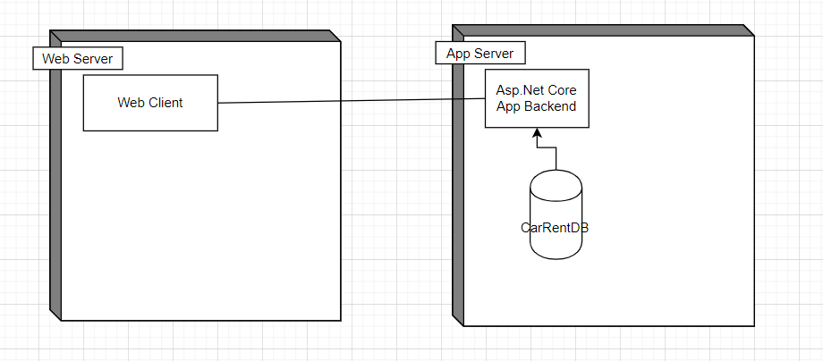

# 4+1 - View

## Deployment View

DB und Web Client sind noch nicht umgesetzt, würden aber so hineinpassen.

## Logical View

Siehe C4 Diagramme.

## Implementation View

* CarRent.Backend
	* Solution
	* CarRent.Backend
		* API
			* v1
				* Cars --> Controller und DTOs
				* Contracts --> Controller und DTOs
				* Customers --> Controller und DTOs
			* (Theoretisch v2)
		* Application
			* // Theoretisch ablage von Services.
		* Domain --> Später enthält er die Micro Services
			* Cars --> Enthält Domain Objects zum Typ Car.
				* Brand
				* Car
				* CarClass
				* ICarRepository
			* Contracts--> Enthält Domain Objects zu den Contracttypen 
				* IContract
				* IRentContractRepository
				* IReservationContractRepository
				* IRentContractRepository
				* RentContract
				* ReservationContract
			* Customers --> Enthält alle Domain Objects zum Customer
				* Customer
				* ICustomerRepository
		* Infrastructure --> Enthält klassen mit Db-Zugriffen
			* Persistance
				* CareRentDbContext
				* CarRepository
				* CustomerRepository
				* RentContractRepository
				* ReservationContractRepository