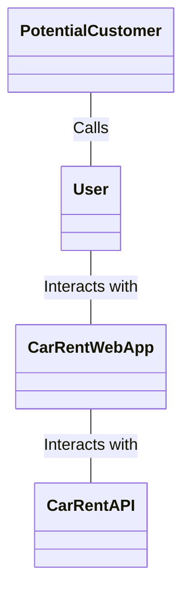
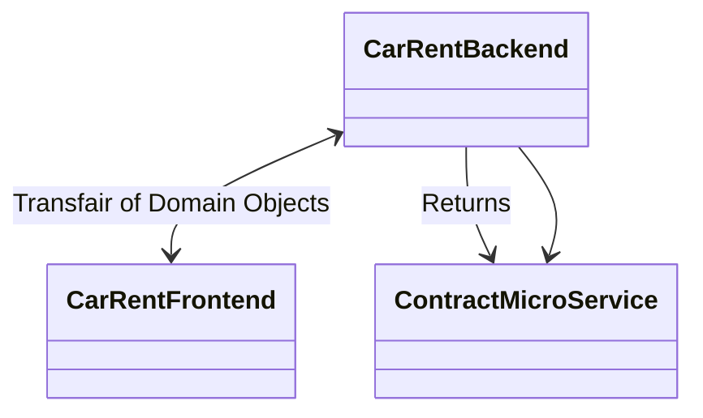
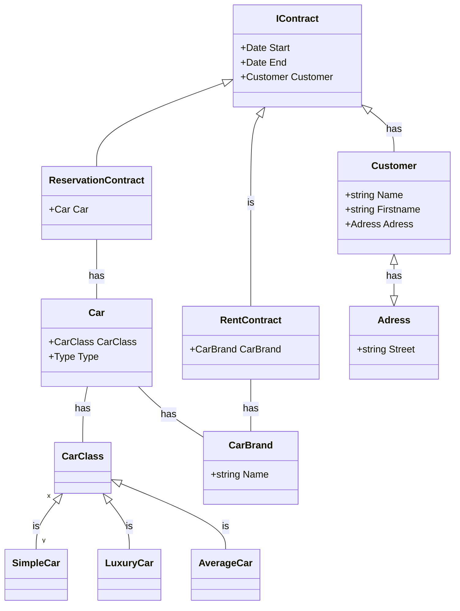

# Big Picture via C4-Pattern

* Der Sachbearbeiter kann Kunden mit Namen und Adresse und Kundennummer im System verwalten,
d.h. erfassen, bearbeiten, löschen und den Kunden mit dessen Namen oder Kundennummer suchen.
* Der Sachbearbeiter kann zudem die Autos von CarRent verwalten und nach denen suchen.
* Jedes Auto kann einer bestimmten Klasse zwischen Luxusklasse, Mittelklasse oder Einfachklasse
zugeordnet werden und besitzt zudem eine Marke, einen Typ und eine eindeutige Identifikation.
* Jede Klasse besitzt eine Tagesgebühr.
* Bei einer neuen Reservation kann der Kunde ein Auto aus einer bestimmten Klasse wählen. Er muss
zudem die Anzahl der Tage (Start/Enddatum) angeben, die er das Auto gerne mieten möchte. Dabei
werden die Gesamtkosten berechnet. Wird die Reservation gespeichert, so wird sie mit einer
Reservationsnummer ablegt.
* Bei Abholung des Autos wird die Reservation in einen Mietvertrag umgewandelt.

## Context  

## Container  

## Components 

* Car
  * Via CarController und Repo könnnen Autos verwaltet werden.
* ReservationContract
  * Via ReservationContractController und Repo können Reservationen verwaltet werden.
* RentContract
  * Via RentContractController und Repo können Reservationen in Mietverträge umgewandelt werden und diese verwaltet werden.
* Customer
  * Via CustomerController und Repo können Kunden verwaltet werden.

## Classes

[mermaid-link](https://mermaid-js.github.io/mermaid-live-editor/edit#eyJjb2RlIjoiY2xhc3NEaWFncmFtXG4gICAgQ2FyQ2xhc3MgPHwtLSBTaW1wbGVDYXIgOiBpc1xuICAgIENhckNsYXNzIDx8LS0gTHV4dXJ5Q2FyIDogaXNcbiAgICBDYXJDbGFzcyA8fC0tIEF2ZXJhZ2VDYXIgOiBpc1xuICAgIENhciAtLSBDYXJCcmFuZCA6IGhhc1xuICAgIENhciAtLSBDYXJDbGFzcyA6IGhhc1xuICAgIFJlbnRDb250cmFjdCAtLSBDYXJCcmFuZCA6IGhhc1xuICAgIFJlc2VydmF0aW9uQ29udHJhY3QgLS0gQ2FyIDogaGFzXG4gICAgSUNvbnRyYWN0IDx8LS0gQ3VzdG9tZXIgOiBoYXNcbiAgICBDdXN0b21lciA8fC0tfD4gQWRyZXNzIDogaGFzXG4gICAgSUNvbnRyYWN0IDx8LS0gUmVudENvbnRyYWN0IDogaXNcbiAgICBJQ29udHJhY3QgPHwtLSBSZXNlcnZhdGlvbkNvbnRyYWN0XG4gICAgY2xhc3MgQ3VzdG9tZXJ7XG4gICAgICArc3RyaW5nIE5hbWVcbiAgICAgICtzdHJpbmcgRmlyc3RuYW1lXG4gICAgICArQWRyZXNzIEFkcmVzc1xuICAgIH1cbiAgICBjbGFzcyBBZHJlc3N7XG4gICAgICArc3RyaW5nIFN0cmVldFxuICAgIH1cbiAgICBjbGFzcyBDYXJ7XG4gICAgICArQ2FyQ2xhc3MgQ2FyQ2xhc3NcbiAgICAgICtUeXBlIFR5cGVcbiAgICB9XG4gICAgY2xhc3MgQ2FyQ2xhc3Mge1xuICAgIH1cbiAgICBjbGFzcyBDYXJCcmFuZCB7XG4gICAgK3N0cmluZyBOYW1lXG4gICAgfVxuICAgIGNsYXNzIElDb250cmFjdCB7XG4gICAgICAgICtEYXRlIFN0YXJ0XG4gICAgICAgICtEYXRlIEVuZFxuICAgICAgICArQ3VzdG9tZXIgQ3VzdG9tZXJcbiAgICB9XG4gICAgY2xhc3MgUmVzZXJ2YXRpb25Db250cmFjdCB7XG4gICAgICAgICtDYXIgQ2FyXG4gICAgfVxuICAgIGNsYXNzIFJlbnRDb250cmFjdCB7XG4gICAgICAgICtDYXJCcmFuZCBDYXJCcmFuZFxuICAgIH1cbiAgICAgICAgICAgICIsIm1lcm1haWQiOiJ7XG4gIFwidGhlbWVcIjogXCJkYXJrXCJcbn0iLCJ1cGRhdGVFZGl0b3IiOmZhbHNlLCJhdXRvU3luYyI6dHJ1ZSwidXBkYXRlRGlhZ3JhbSI6ZmFsc2V9)

Abweichungen:

Adressen wurden der Einfachheit weggelsassen.

Simple, Luxury und Average Car wurden zu Strings / Identifiers für die CarClass.