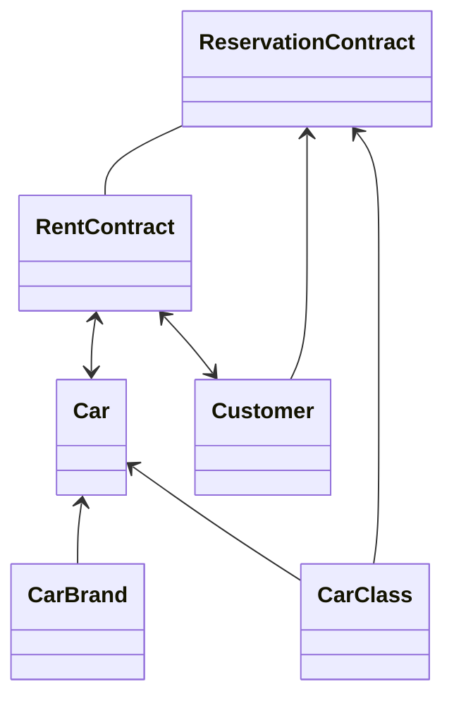

# Domain Model

Im Car Rent sind uns 4 erschiedene Domänen bekannt.

* Car
	* Autos mit Marke und Klasse
* Customer
	* Mit Adresse und Personenangaben
* ReservationContract
	* Reservierungen mit Verknüpfung zur Person und zur Klasse
* RentContract
	* Ausleihe mit Verknüpfung zum Auto und der Person.
	* Umwandlung einer Reservierung zu einer Ausleihe

